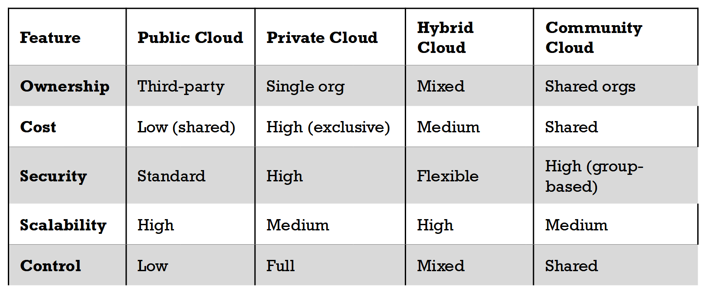
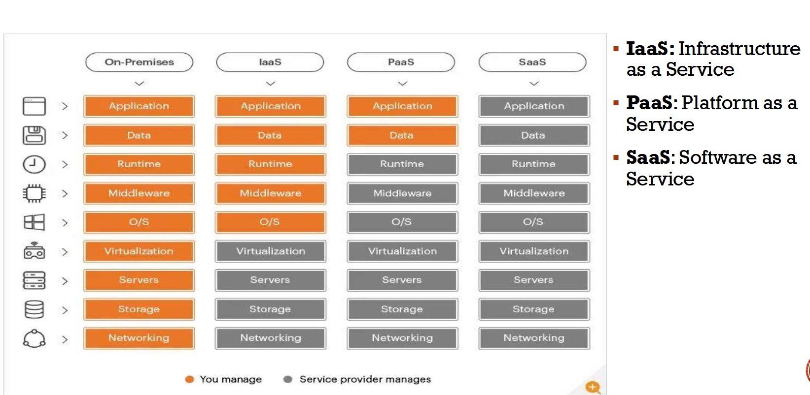
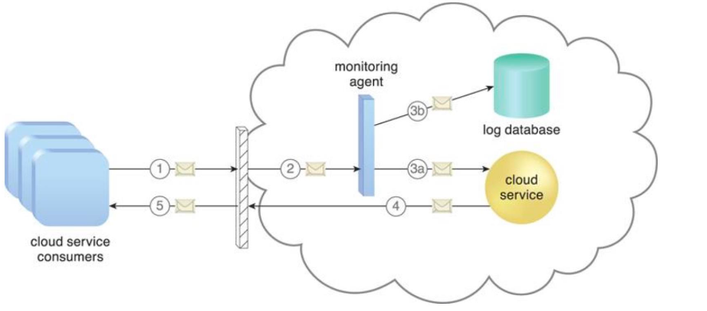
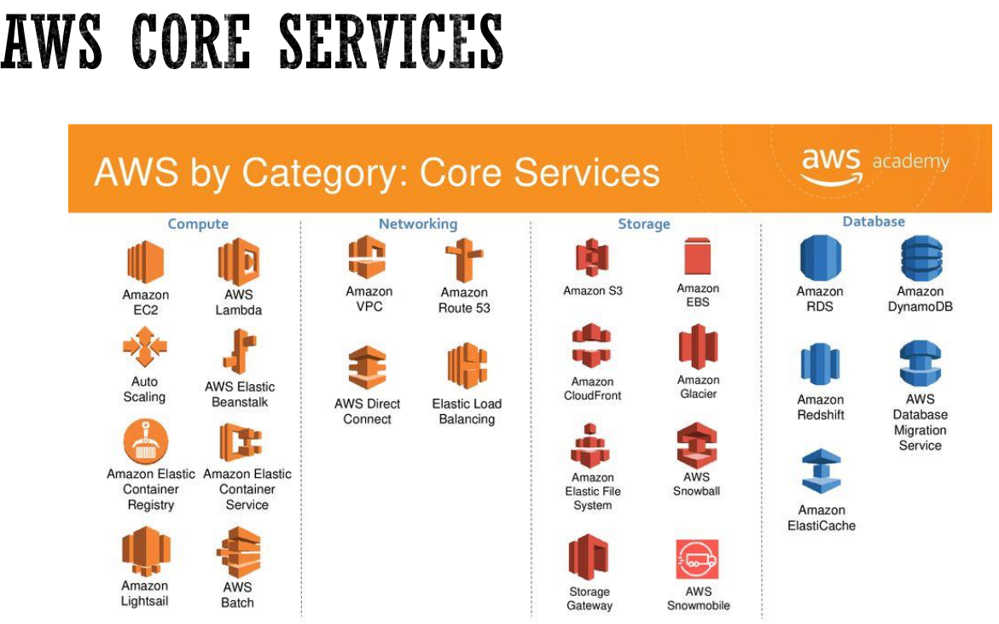
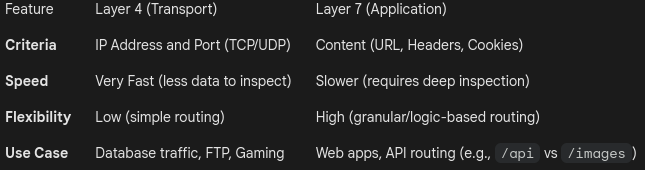

# Cloud Computing — Course Notes (Weeks 1–7)

> Clean, modern, and professional version of the original course notes. Intended for GitHub: readable, navigable, and ready to share.

---

[](LICENSE)  

## Table of contents

1. [Overview](#overview)
2. [How to use this repository](#how-to-use-this-repository)
3. [Week 1 — Introduction to Cloud Computing](#week-1---introduction-to-cloud-computing)

   * What is cloud computing
   * Benefits
   * Deployment models
   * Service models
4. [Week 2 — Cloud Computing Technologies](#week-2---cloud-computing-technologies)

   * Cloud infrastructure and components
   * Compute, storage, network, databases
   * Scaling and serverless
   * Cloud providers & AWS overview
5. [Networking in Cloud](#networking-in-cloud)

   * Components, topology and security
   * Load balancing
6. [Week 3 — Storage Solutions in Cloud](#week-3---storage-solutions-in-cloud)

   * Ephemeral vs persistent storage
   * Block, file, object storage
7. [Week 5 — Cloud Security](#week-5---cloud-security)

   * Key aspects, threats, shared responsibility
   * IAM, data protection, key management
8. [Week 6 — Infrastructure as Code (IaC)](#week-6---infrastructure-as-code-iac)

   * Benefits, best practices, Terraform primer
9. [Cloud Native & DevOps](#cloud-native--devops)

   * Microservices vs monolith
   * CI/CD, containers
10. [Appendix: Links & References](#appendix-links--references)
11. [Contributing](#contributing)
12. [License](#license)

---

## Overview

This repository contains short, well-organized notes on cloud computing covering the first six weeks of study. The content preserves all original material and refactors it into a modern README suitable for GitHub. Visual assets from the original (`./IMG/*.png`) are referenced directly; keep them in the same folder when you publish.

Source: original notes included in this repo. fileciteturn0file0

---

## How to use this repository

* Read `README_modern.md` on GitHub for a quick, linear reading experience.
* Refer to the `IMG/` folder for diagrams included in the original notes (service model, cloud model, AWS core services, etc.).
* Use the Table of Contents to jump to a topic.

---

# Week 1 — Introduction to Cloud Computing

## What is Cloud Computing?

Cloud computing is the delivery of compute, storage, databases, networking, and other IT services over the Internet. Users pay for resources they consume instead of buying and operating physical hardware.

### Concise definition

> Delivering compute, storage, and platform services over the internet with pay-as-you-go pricing.

## Benefits of Cloud Computing

* **Cost savings**

  * No upfront hardware purchases
  * Pay-as-you-go (compute, storage, bandwidth)
  * Reduced maintenance and IT staff overhead
* **Scalability & flexibility**

  * Elastic scaling to handle traffic spikes
  * Useful for seasonal workloads
* **Global accessibility**

  * Access services from anywhere; supports global teams
* **Faster time-to-market**

  * Provision infrastructure and launch applications quickly
  * Faster development, testing, and deployment cycles
* **Access to advanced services**

  * AI/ML, big data, IoT, blockchain without heavy setup
* **Automatic maintenance and updates**

  * Provider-managed upgrades and patching
* **Disaster recovery & business continuity**

  * Multi-datacenter backups and failover

## Cloud Deployment Models

* **Public Cloud** — Provider-managed shared infrastructure
* **Private Cloud** — Dedicated infrastructure for a single organization
* **Hybrid Cloud** — Mix of public and private for flexibility
* **Community Cloud** — Shared infrastructure for organizations with similar needs



## Cloud Service Models

* **IaaS (Infrastructure as a Service)** — Rent virtual machines, networks, block storage; you manage OS, runtime, apps and data.
* **PaaS (Platform as a Service)** — Provider manages OS and platform; you deploy apps and data.
* **SaaS (Software as a Service)** — Provider manages everything; users just consume the application.



---

# Week 2 — Cloud Computing Technologies

## What is Cloud Infrastructure?

Cloud infrastructure is the set of compute, storage, network, and platform components combined to run cloud services. It includes virtualized resources (VMs, containers), storage systems, network fabrics, and management layers.

## Components of Cloud Infrastructure

### Compute

* Runs VMs and workloads
* Supports containers and serverless platforms
* Dynamic, horizontally- and vertically-scalable

### Storage

* **Object storage** — Unstructured data (images, video, logs); accessed via HTTP/REST; highly scalable
* **Block storage** — Low-latency raw disk volumes for VMs (e.g., AWS EBS)
* **File storage** — Shared file systems with hierarchical directories for collaborative use

### Network

* Logical networking constructs (VPCs, subnets)
* Load balancers, virtual firewalls, security groups
* Private and public IP addressing, routing, gateways

### Database

* **Relational (SQL)** — Structured, normalized data; transactional integrity
* **Non-relational (NoSQL)** — Scale-out, flexible schemas for high throughput

### Monitoring & Observability

* Real-time logging and telemetry to detect and troubleshoot issues



## Scaling in Cloud

* **Vertical scaling (scale up/down)** — Add CPU/RAM to a single instance (may require downtime)
* **Horizontal scaling (scale out/in)** — Add/remove instances behind a load balancer (preferred for availability)

## Serverless Architecture

* Run code without managing servers; platform auto-scales. Good for event-driven workloads and microservices that need bursty scale.

## Cloud Service Providers & AWS Overview

* Major providers: AWS, Azure, Google Cloud
* AWS provides global regions and availability zones (AZs) for resiliency

### AWS Global Infrastructure

* **Region** — geographic area containing multiple AZs
* **Availability Zone (AZ)** — isolated data center with independent networking & power; designed to avoid single points of failure

### AWS Core Services (visual)



### Access methods to cloud services

* Web console (provider UI)
* CLI (e.g., AWS CLI)
* Infrastructure as Code (IaC): Terraform, CloudFormation, AWS CDK
* SDKs (Python, JavaScript, Java, Ruby)

References / videos (original links retained):

* What is AWS? — [https://www.youtube.com/watch?v=a9__D53WsUs&ab_channel=AmazonWebServices](https://www.youtube.com/watch?v=a9__D53WsUs&ab_channel=AmazonWebServices)
* AWS EC2 overview — [https://www.youtube.com/watch?v=TsRBftzZsQo](https://www.youtube.com/watch?v=TsRBftzZsQo)

---

# Networking in Cloud

## Cloud Networking

Design networks for efficiency, security, and scalability to support cloud resources and services.

### Key network components

* **VPC (Virtual Private Cloud)** — an isolated virtual network

  * Control subnets, routing, gateways, security groups
* **Subnets** — IP ranges for segmentation and traffic control
* **Load balancers** — distribute traffic across backend instances
* **Gateways & routing** — connect networks and manage traffic paths
* **Security groups / NACLs** — packet- and instance-level filtering
* **DNS** — name resolution for services

### Types of networking services

* VPN
* Direct Connect / Dedicated Connection
* Load balancers (Layer 4 / Layer 7)
* CDN (Content Delivery Network)

### Benefits

* Cost-efficient pay-as-you-go model
* High performance & reliability through distributed data centers
* Global connectivity and elasticity
* Built-in mitigations: DDoS protection, advanced routing

## Network Topologies

* **Flat network** — single subnet; simple but no segmentation
* **Hub-and-spoke** — central hub VPC manages security & routing for spoke networks
* **Mesh network** — fully-connected VPCs for maximum redundancy

## Security best practices

* Network segmentation to minimize lateral movement
* Strict firewall rules and traffic filtering
* Encrypt data in transit (TLS/SSL) and at rest
* Apply least-privilege access via IAM
* Centralized logging, monitoring and auditing

## Load Balancers

Core role: distribute incoming traffic across backend resources to increase availability and performance.

### Components

* Load balancer (router)
* Backend resources (instances, containers)
* Health checks
* Session persistence (sticky sessions)
* Autoscaling integration

### Benefits

1. High availability and failover
2. Horizontal scaling capability
3. Improved performance by distributing load
4. Security features such as SSL termination and DDoS mitigation



---

# Week 3 — Storage Solutions in Cloud

## Cloud storage overview

Cloud storage abstracts and provides remote storage via networked services. Two main categories:

* **Ephemeral** — short-lived storage for running compute (containers, VMs)
* **Persistent** — durable storage surviving instance restarts and termination

### Types of storage

* **Block storage** — raw disk volumes used by VMs (low latency)
* **File storage** — network file systems with directories and shared access
* **Object storage** — large-scale storage for unstructured data (objects indexed by unique IDs)

---

# Week 5 — Cloud Security

## Cloud service models recap

* IaaS, PaaS, SaaS and the security implication for each

## Key aspects of cloud security

* **Data protection** — encryption, backups, DR
* **Access control / IAM** — authentication, authorization, least privilege
* **Network security** — segmentation, filtering, monitoring, DDoS protection
* **Compliance** — HIPAA, PCI-DSS, GDPR, and other regulatory frameworks
* **Incident response** — detect, contain, recover

## Common threats and challenges

* Data breaches
* Insecure APIs and misconfigurations
* Human error and insider threats
* Account hijacking and compromised credentials
* DDoS attacks
* Lack of policy, governance, and automation

## Shared responsibility model

* **Provider responsibility** — physical infrastructure, some managed services
* **Customer responsibility** — OS, middleware (PaaS), data, configurations, identity controls

**Always identify which layers you control and secure them.**

## Identity & Access Management (IAM)

* Authentication (who you are) and Authorization (what you can do)
* Principles: least privilege, separation of duties
* Lifecycle: create → authenticate → authorize → revoke
* Authentication methods: passwords, PINs, OTP, push, biometrics
* Federation & SSO recommended to reduce repeated credentials

## Protecting data

* **Tokenization** — replace sensitive values with tokens
* **Encryption** — data at rest and in transit
* Combine tokenization and encryption for stronger protection

## Key management

* Purpose: create, store, rotate, and revoke cryptographic keys
* Approaches:

  * Provider-managed keys (easy but provider has access)
  * Customer-managed keys (you control access and rotation)
  * BYOK (Bring Your Own Key) — generate keys outside and import for strict compliance

---

# Week 6 — Infrastructure as Code (IaC)

## What is IaC?

Infrastructure as Code is the practice of managing and provisioning infrastructure through code. IaC makes deployments repeatable, auditable, and automatable.

## Problems with manual ops

* Hard to track drift
* Documentation becomes stale
* Environments differ across machines

## Benefits of IaC

* Consistency and reproducibility
* Time savings and reduced human error
* Easier governance, security and compliance controls
* Faster delivery through automation and CI/CD

## Best practices

* Store IaC in version control (git)
* Structure code modularly and make components reusable
* Use test-first and plan (e.g., `terraform plan`) to preview changes
* Use change management and code review for infra changes
* Keep code simple and readable

## Mutable vs immutable infrastructure

* **Mutable** — update existing servers over time (easier for small systems)
* **Immutable** — replace entire resources when changing (safer for high-scale, automated environments)

### Choosing an approach

* Mutable for smaller systems and frequent manual changes
* Immutable for cloud-native, CI/CD-driven workflows with strong automation

## Terraform primer

* Terraform is a declarative IaC tool to define resources in human-readable files
* Key commands: `terraform init` (prepare), `terraform plan` (preview), `terraform apply` (apply changes)
* Tracks state in `terraform.tfstate` — protect it; it may contain sensitive data

Example resource:

```hcl
resource "aws_instance" "web" {
  ami           = "ami-12345678"
  instance_type = "t2.micro"
}
```

Variables and modules improve reuse and manageability:

```hcl
variable "region" {
  default = "us-east-1"
}

module "vpc" {
  source     = "./vpc"
  cidr_block = "10.0.0.0/16"
}
```

---

# Week 7 - Cloud Native

## What is Cloud Native?

Cloud-native is an approach to build scalable, resilient, and manageable applications for cloud platforms. It emphasizes containers, microservices, automation, and CI/CD.

## Cloud-native benefits

* Faster development and deployment
* Platform independence and portability
* Cost-effective operations via efficient resource usage

## Key concepts

* DevOps collaboration and automation
* Continuous Integration and Continuous Delivery (CI/CD)
* Microservices architecture and containerization
* Observability and monitoring

## Monolith vs Microservices

* **Monolith**: single deployable unit (UI, logic, DB together). Easier to start but harder to scale and maintain as system grows.
* **Microservices**: many small services, each independently deployable. Pros: independent scaling and releases; Cons: greater operational complexity.

## Service communication

* **Synchronous** (HTTP/REST): caller waits for reply
* **Asynchronous** (message broker, pub/sub): decouples services and improves resilience

### When to choose microservices

* App size and complexity require independent scaling
* Large teams needing autonomy
* Need for polyglot stacks or frequent independent releases

### When not to choose microservices

* Small apps or startups where simplicity matters
* Teams with tight deadlines and limited operational capacity

---

# Appendix: Links & References

* AWS introduction video (original): [https://www.youtube.com/watch?v=a9__D53WsUs&ab_channel=AmazonWebServices](https://www.youtube.com/watch?v=a9__D53WsUs&ab_channel=AmazonWebServices)
* AWS EC2 overview (original): [https://www.youtube.com/watch?v=TsRBftzZsQo](https://www.youtube.com/watch?v=TsRBftzZsQo)

(Keep `IMG/` folder with: `model.png`, `service-model.png`, `cloud-mechanism.png`, `csp.png`, `aws-core-service.png`, `typeloadbalancer.png` to preserve diagrams.)

---

# Contributing

* Improvements and corrections welcome. Open a PR with changes.
* If you add diagrams, place them in `IMG/` and update their references in this README.
* Use clear commit messages and maintain the content scope (course notes).

---

# License

This repository is provided under the MIT License. See `LICENSE` for details.