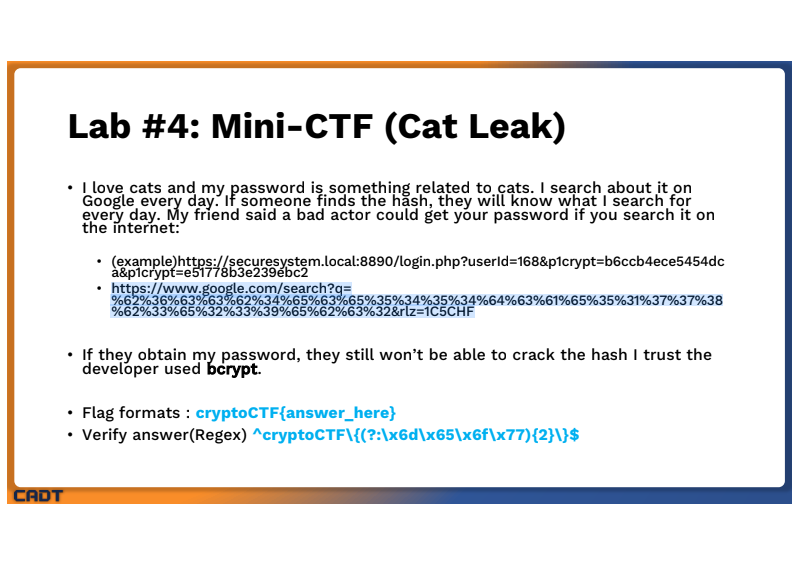
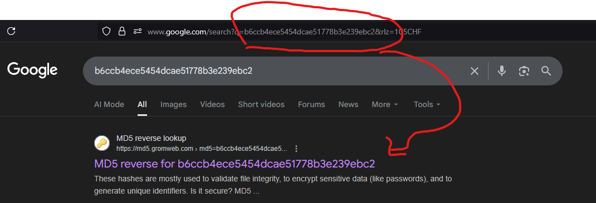
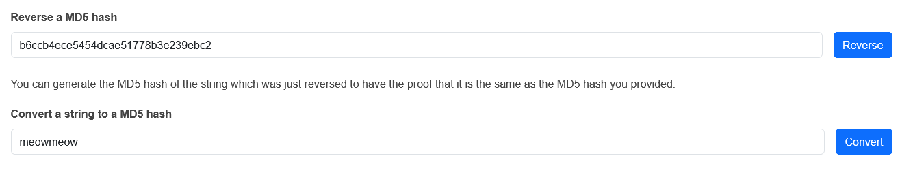
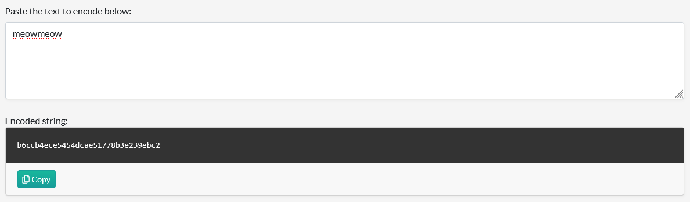

# **HashStart — ( Week 3 ) — DAYUTH THY**

## Repo layout

```
.
├─ main.go
├─ go.mod
├─ README.md
├─ results.txt
├─ nord_vpn.txt
└─ imgs/
   └─ 1.png
   └─ 2.png
   └─ 3.png
   └─ 4.png
└─ utils/
   └─ crack/
      ├─ md5.go
      ├─ sha1.go
      └─ sha512.go
```

## What it does (quick)

* `computeHashes(text string)` → returns `map[string]string` with `MD5`, `SHA1`, `SHA256`, `SHA512`, `SHA3-256`.
* `proofMe(a, b string)` → prints hashes for `a` and `b` and `Match!` / `No Match!`.
* `crack.CrackMD5(target, wordlist)`, `crack.CrackSHA1(...)`, `crack.CrackSHA512(...)` → scan `nord_vpn.txt`, return plaintext if found.

## Wordlist

Place `nord_vpn.txt` in the repo root. Example to download raw file:

```bash
curl -L -o nord_vpn.txt \
  https://raw.githubusercontent.com/kkrypt0nn/wordlists/main/wordlists/passwords/nord_vpn.txt
```

## **>> [Results](https://github.com/T0fuHasuu/CADT-Cybersecurity/blob/main/Y3/T1/cryptography/Assignment/Hashstart/results.txt) <<**

```bash
# Task0 Checksum
Please input value 1 : Hello
Please input value 2 : Hello
========Name + Hashing Program========

Hash (MD5) : 8b1a9953... / 8b1a9953... => Match!
Hash (SHA1) : f7ff9e8b... / f7ff9e8b... => Match!
Hash (SHA256) : 185f8db3... / 185f8db3... => Match!
Hash (SHA512) : 3615f80c... / 3615f80c... => Match!
Hash (SHA3-256) : 8ca66ee6... / 8ca66ee6... => Match!

# Task1 MD5
FOUND :  Google101     

# Task2 Sha1
FOUND :  Princess1  

# Task3 Sha512
FOUND :  Gutter11          
```

## Task 4






```go
// Check and Compare
test := "meowmeow"
sum := md5.Sum([]byte(test))
digest := hex.EncodeToString(sum[:])
target4 := "b6ccb4ece5454dcae51778b3e239ebc2"
if digest == target4 {
 fmt.Printf("Matched!! FLAG: cryptoCTF{%s}\n", test)
} else {
 fmt.Printf("MD5(%q) = %s (target %s) - not a flag\n", test, digest, target4)
}
```

> **Result : Matched!! FLAG: cryptoCTF{meowmeow}**
