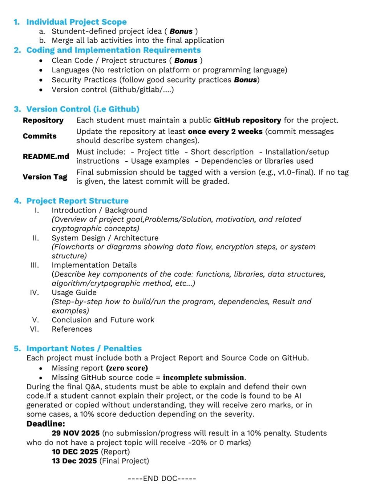

# **ESP32-Based Password Manager with Salted SHA-256 and Firebase Storage**

## **Instruction**



---

## **Project Overview**

This project implements a **hardware-assisted password management system** using an **ESP32 microcontroller**, **SHA-256 cryptographic hashing**, and **Firebase Realtime Database** as a remote storage backend.

The ESP32 acts as a **trusted cryptographic processor** that generates secure random salts, computes salted SHA-256 password hashes, and verifies user-supplied passwords through a built-in **HTTP web interface**.

All passwords are protected using **salted hashing**, and **no plaintext passwords are stored** on the device or in Firebase.

This project demonstrates applied knowledge in **embedded cryptography**, **secure password storage**, **authentication mechanisms**, and **IoT–cloud integration**, designed for academic and learning purposes.

---

# **Objectives**

1. Provide a secure method to store and verify passwords without storing plaintext credentials.
2. Use the ESP32 as a trusted cryptographic core for hashing and verification.
3. Implement salted SHA-256 hashing using a hardware-based random salt.
4. Protect verification with an additional SHA-256–based authorization step.
5. Integrate embedded hardware, Wi-Fi, Firebase, and cryptographic libraries into a functional security application.

---

# **System Architecture (High-Level)**

### **1. ESP32 (Trusted Cryptographic Core)**

* Generates cryptographically secure random salts
* Computes SHA-256 hashes using mbedTLS
* Verifies passwords locally
* Hosts a lightweight HTTP web server
* Connects to Wi-Fi automatically on boot
* Performs all cryptographic operations locally

### **2. Firebase Realtime Database (Untrusted Storage)**

Firebase **never stores plaintext passwords**.

Stored data consists only of salts and hashes.

| Path                         | Contents                  |
| ---------------------------- | ------------------------- |
| **`/passwords/<name>/salt`** | Random salt (hex-encoded) |
| **`/passwords/<name>/hash`** | SHA-256(salt || password) |

This ensures that even if Firebase is compromised, passwords cannot be recovered directly.

### **3. User Web Interface (Browser)**

The user interacts through a browser on the same network:

* Create password entries
* Verify stored passwords
* Trigger ESP32 reboot

No client-side cryptography is performed.

---

# **Directory Summary**

```
SELF-PROJECT/
│
├── main.ino                 
│
├── docs/
│   └── THY_DAYUTH_ESP32_PASSWORD_MANAGER.pdf   
│
├── IMG/
│   └── self-project-instruction.jpg
│   
├── data/
│   └── sample.json
│   └── structure.json
│
├── README.md
│
└── .gitignore
```

---

# **Complete Workflow**

## **1. Initialization**

* ESP32 boots
* Automatically connects to Wi-Fi using configured SSID and password
* Initializes Firebase connection
* Starts an HTTP web server on port 80
* Turns on LED indicator when Wi-Fi is connected

---

## **2. Main Menu (Web Interface)**

The ESP32 provides a simple web UI with the following options:

```
- Create Password
- Verify Password
- Quit (Reboot)
```

---

## **3. Creating a Password (Hashing Path)**

When the user selects **Create Password**:

1. User enters:

   * Password name (identifier)
   * Plaintext password
2. ESP32 generates:

   * Random salt (16 bytes) using `esp_fill_random`
3. ESP32 computes:

   * `SHA256(salt || password)`
4. Firebase stores:

   * **/passwords/name/salt**
   * **/passwords/name/hash**
5. ESP32 confirms successful storage

**Plaintext passwords are never uploaded or stored.**

---

## **4. Verifying a Password (Verification Path)**

When the user selects **Verify Password**:

1. User enters:

   * Password name
   * Authorization hash (SHA-256 gatekeeper)
   * Password to verify
2. ESP32 retrieves:

   * Salt from Firebase
   * Stored hash from Firebase
3. ESP32 computes:

   * `SHA256(salt || input_password)`
4. ESP32 compares:

   * Computed hash vs stored hash
5. Result:

   * **Password VERIFIED**
   * **Password INVALID**

---

## **5. Quit**

* ESP32 reboots
* Clears runtime state
* Requires fresh authentication on next session

---

# **Security Features**

### **1. Salted SHA-256 Hashing**

* Prevents rainbow-table attacks
* Each password has a unique random salt
* Hashing performed using mbedTLS

### **2. Hardware-Based Randomness**

* Uses ESP32 hardware RNG (`esp_fill_random`)
* Ensures unpredictable salt values

### **3. Authorization Gatekeeper**

* Verification requires an additional SHA-256 authorization hash
* Prevents unauthorized verification attempts

### **4. No Plaintext Storage**

* No plaintext passwords stored on ESP32
* No plaintext passwords stored in Firebase

### **5. Local Cryptographic Operations**

* ESP32 performs all hashing and comparisons
* Firebase acts only as untrusted storage

---

# **Installation & Setup**

## **Requirements**

* ESP32 development board
* Arduino IDE or PlatformIO
* Firebase Realtime Database project
* Wi-Fi network

## **Configuration**

Edit the following values in the sketch before uploading:

```cpp
#define SSID      "YOUR_WIFI"
#define PASSWORD  "YOUR_WIFI_PASSWORD"
#define API_KEY   "YOUR_FIREBASE_API_KEY"
#define DB_URL    "https://your-project-id.firebaseio.com/"
```

> ⚠️ **Do NOT commit real credentials to a public repository**

---

# **Running the Program**

1. Upload the sketch to the ESP32
2. Open Serial Monitor (115200 baud)
3. Note the assigned IP address
4. Open a browser and visit:

```
http://<ESP32-IP>/
```

---

# **Version Control (GitHub Requirement)**

* Public GitHub repository maintained
* Commit updates at least once every 2 weeks
* Commit messages describe system changes

### **Final Version Tag**

```bash
git tag v1.0-final
git push origin v1.0-final
```

---

# **Limitations & Academic Disclosure**

* Single SHA-256 is not ideal for production password storage
* HTTP is used instead of HTTPS
* Hard-coded authorization hash is for demonstration only

**Recommended future improvements:**

* PBKDF2 / Argon2 password hashing
* Firebase Authentication
* HTTPS gateway or reverse proxy
* Rate limiting and lockout policies

---

# **References**

* ESP32 Technical Reference Manual
* mbedTLS Documentation
* Firebase Realtime Database Documentation
* NIST SP 800-63B (Password Security)
* William Stallings, *Cryptography and Network Security*

